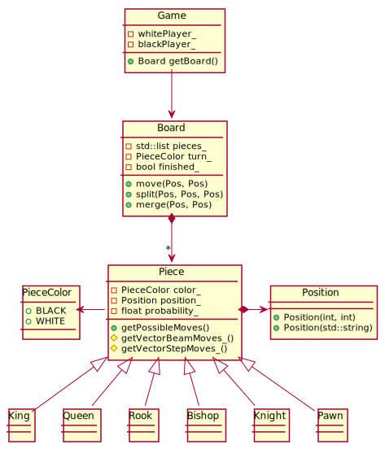
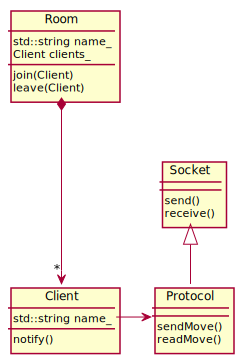

# TDP1-TPF
Taller de Programación I - TP Final

## Content
* [1. Build](#1-build)
  * [1.1. Install SDL2pp](#11-install-sdl2pp)
  * [1.2. Build Project](#12-build-project)
* [How to Play](#)
* [2. Tasks](#2-tasks)
* [3. Diagrams](#3-diagrams)
    * [3.1. Chess](#31-chess)
    * [3.2. Server-Client](#32-server-client)

## 1. Build
### 1.1. Install SDL2pp
```shell
sudo apt-get install libsdl2-2.0-0
sudo apt-get install libsdl2-image-2.0-0
sudo apt-get install libsdl2-mixer-2.0-0
sudo apt-get install libsdl2-ttf-2.0-0
sudo apt-get install libsdl-dev
sudo apt-get install libsdl2-image-dev
sudo apt-get install libsdl2-mixer-dev
sudo apt-get install libsdl2-ttf-dev
```
```shell
cd /TDP1-TPF/libs/libSDL2pp
cmake . && make && make install
```

### 1.2. Build Project
Use our bash script to build the project! This will also execute the tests automatically.
```shell
$ sh build.sh
$ cd build
$ ./SERVER
$ ./CLIENT
```

Or, if you prefer to do it yourself, you can manually the following.
```shell
$ rm -r build
$ mkdir build
$ cd build
$ cmake ..
$ make
$ ./TESTS
$ ./SERVER
$ ./CLIENT
```

## 2. Tasks
[Task division](https://docs.google.com/document/d/12KN0JOcInUOU4T9rDWUngS-od8_TPaNX0qz0X8ciDgI/edit?usp=sharing)

## 3. Diagrams
### 3.1. Chess


### 3.2. Server-Client

